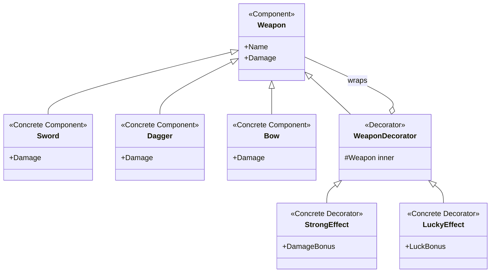

```mermaid
classDiagram
    direction TB

    class Weapon {
        <<Component>>
        +Name
        +Damage
    }

    class Sword {
        <<Concrete Component>>
        +Damage
    }

    class Dagger {
        <<Concrete Component>>
        +Damage
    }

    class Bow {
        <<Concrete Component>>
        +Damage
    }

    class WeaponDecorator {
        <<Decorator>>
        #Weapon inner
    }

    class StrongEffect {
        <<Concrete Decorator>>
        +DamageBonus
    }

    class LuckyEffect {
        <<Concrete Decorator>>
        +LuckBonus
    }

    Weapon <|-- Sword
    Weapon <|-- Dagger
    Weapon <|-- Bow

    Weapon <|-- WeaponDecorator
    WeaponDecorator o-- Weapon : wraps

    WeaponDecorator <|-- StrongEffect
    WeaponDecorator <|-- LuckyEffect
```

