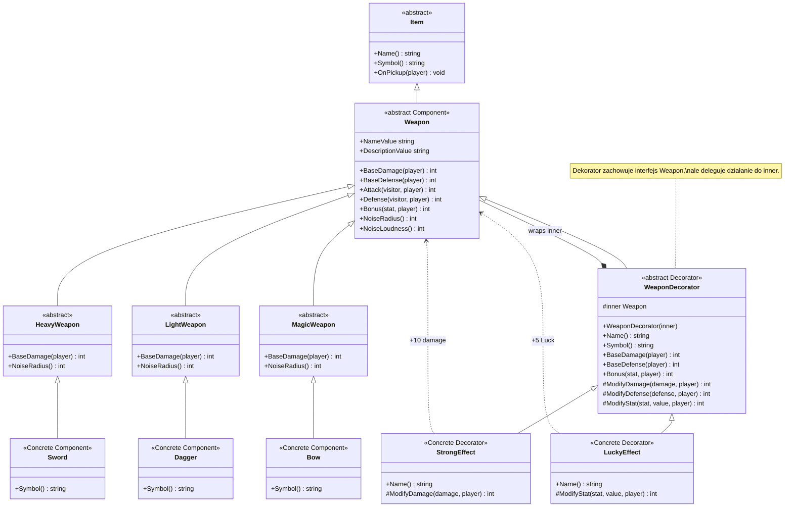

```mermaid
classDiagram
    direction TB

    class Item {
        <<abstract>>
        +Name() string
        +Symbol() string
        +OnPickup(player) void
    }

    class Weapon {
        <<abstract Component>>
        +NameValue string
        +DescriptionValue string
        +BaseDamage(player) int
        +BaseDefense(player) int
        +Attack(visitor, player) int
        +Defense(visitor, player) int
        +Bonus(stat, player) int
        +NoiseRadius() int
        +NoiseLoudness() int
    }

    class HeavyWeapon {
        <<abstract>>
        +BaseDamage(player) int
        +NoiseRadius() int
    }

    class LightWeapon {
        <<abstract>>
        +BaseDamage(player) int
        +NoiseRadius() int
    }

    class MagicWeapon {
        <<abstract>>
        +BaseDamage(player) int
        +NoiseRadius() int
    }

    class Sword {
        <<Concrete Component>>
        +Symbol() string
    }

    class Dagger {
        <<Concrete Component>>
        +Symbol() string
    }

    class Bow {
        <<Concrete Component>>
        +Symbol() string
    }

    class WeaponDecorator {
        <<abstract Decorator>>
        #inner Weapon
        +WeaponDecorator(inner)
        +Name() string
        +Symbol() string
        +BaseDamage(player) int
        +BaseDefense(player) int
        +Bonus(stat, player) int
        #ModifyDamage(damage, player) int
        #ModifyDefense(defense, player) int
        #ModifyStat(stat, value, player) int
    }

    class StrongEffect {
        <<Concrete Decorator>>
        +Name() string
        #ModifyDamage(damage, player) int
    }

    class LuckyEffect {
        <<Concrete Decorator>>
        +Name() string
        #ModifyStat(stat, value, player) int
    }

    Item <|-- Weapon

    Weapon <|-- HeavyWeapon
    Weapon <|-- LightWeapon
    Weapon <|-- MagicWeapon

    HeavyWeapon <|-- Sword
    LightWeapon <|-- Dagger
    MagicWeapon <|-- Bow

    Weapon <|-- WeaponDecorator
    WeaponDecorator *-- Weapon : wraps inner

    WeaponDecorator <|-- StrongEffect
    WeaponDecorator <|-- LuckyEffect

    StrongEffect ..> Weapon : +10 damage
    LuckyEffect ..> Weapon : +5 Luck

    note for WeaponDecorator "Dekorator zachowuje interfejs Weapon,\nale deleguje działanie do inner."
```

