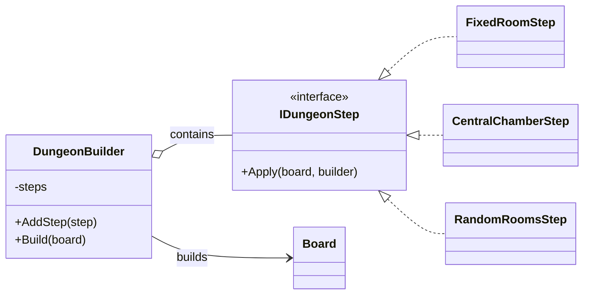
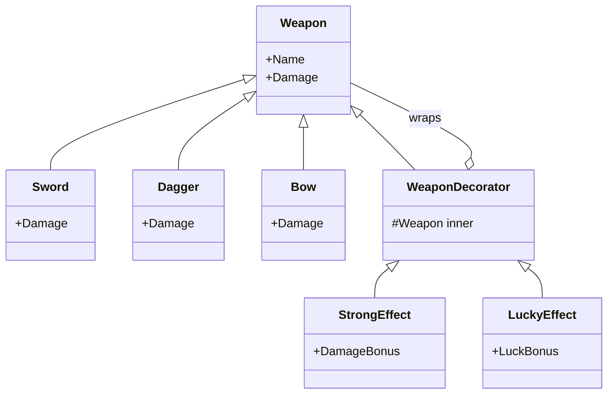
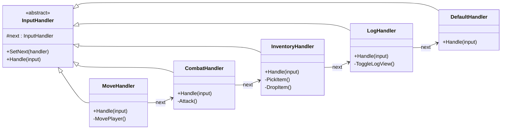
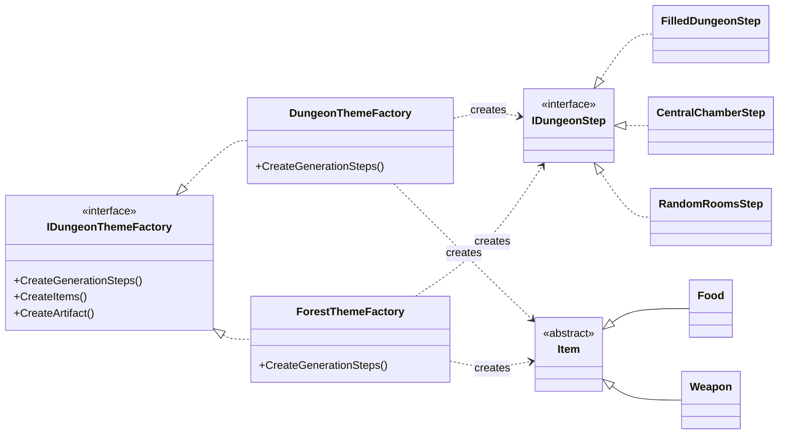
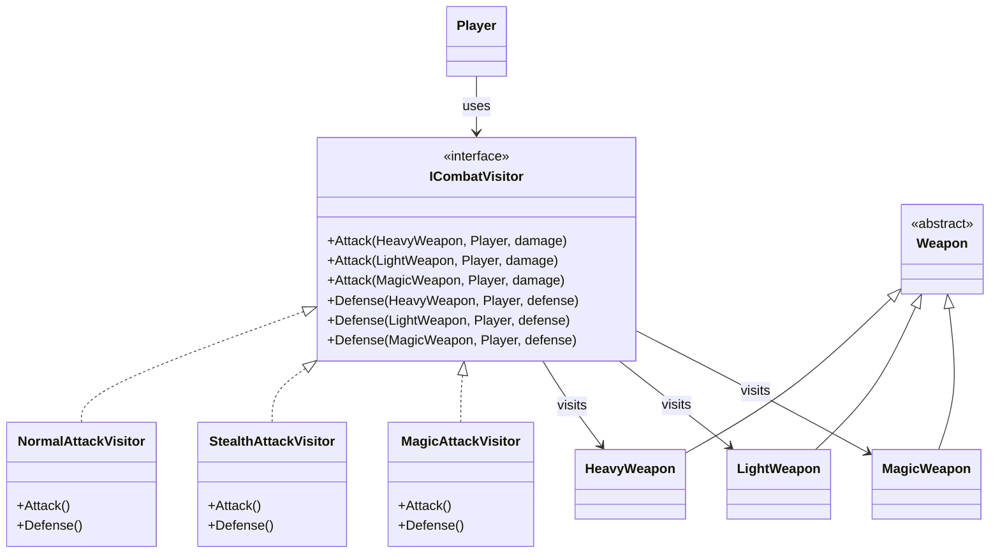
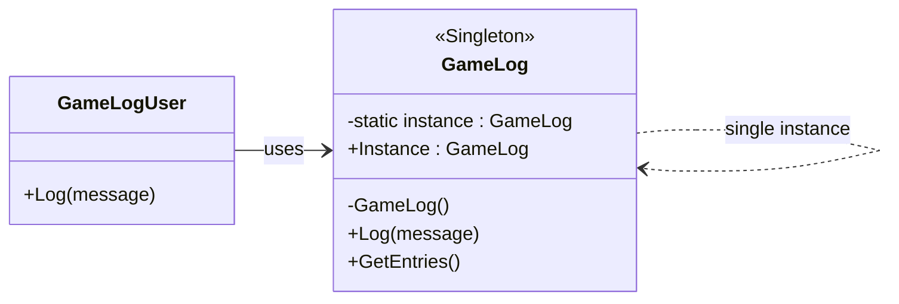
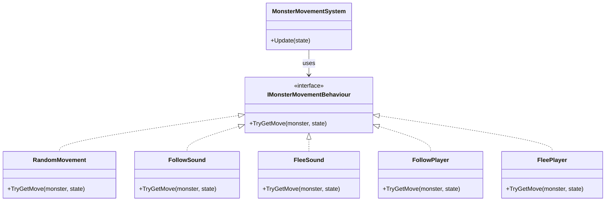
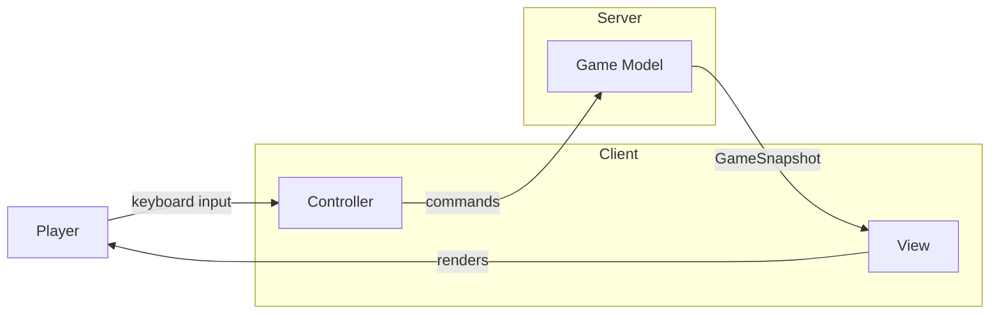

# Wzorce obiektowe

<h3>Builder</h3>

`DungeonBuilder` is responsible for constructing the dungeon map step by step by storing and executing a sequence of generation steps on the `Board`. This separates individual room-generation strategies, such as `FixedRoomStep`, `CentralChamberStep`, and `RandomRoomsStep`, from the building process and allows different combinations of steps to create different dungeon layouts.

`Model/DungeonBuilding/DungeonBuilder.cs `
`Model/DungeonBuilding/Steps/`

<h3>Decorator</h3>

`WeaponDecorator` adds effects to weapons dynamically without modifying their original classes. The weapon itself does not know that it is decorated, allowing effects such as `StrongEffect` and `LuckyEffect` to be combined flexibly while keeping weapons independent.

`Model/Items/Weapons/` 
`Model/Items/Weapons/Effects/`

<strong>Chain of responsibility</strong>

#### Chain of responsibility

`Chain of Responsibility` handles keyboard input in the game by passing each pressed key through a chain of handlers. Each handler checks whether the key belongs to its responsibility, such as movement, combat, inventory or log view; if not, it passes the input to the next handler. This keeps keyboard handling separated into independent parts of the game.

`Model/Input/`

<h3>Abstract Factory</h3>

### Abstract Factory

`Abstract Factory` allows the game to create complete dungeon themes such as **Dungeon, Forest and Bank** through the same factory interface. Each theme can provide its own map-generation steps, items and artifacts without duplicating the code responsible for creating and assembling the game world.

`Model/DungeonBuilding/Themes/`

<h3>Visitor</h3>

`Visitor` is used in the combat system to calculate attack and defense differently depending on the weapon type and the selected combat style. The key feature is that **new operations can be added without modifying the weapon classes**: `NormalAttackVisitor`, `StealthAttackVisitor` and `MagicAttackVisitor` define how each weapon type behaves, while the weapons themselves remain unchanged.

`Model/Combat/`

<h3>Observer</h3>

`Observer` is used in the game to react to the death of a monster belonging to a species. `MonsterSpecies` notifies all subscribed `Monster` objects when one of their members dies, and each monster reacts according to its assigned strategy — for example, `AggressiveSpeciesReaction` increases attack by 5, while `CowardSpeciesReaction` removes its defense. The key feature is that the subject does not need to know how observers react, so new reactions can be added without changing the notification mechanism.

`/Model/Entities/Species` 

<h3>Singleton</h3>

`Singleton` provides global access to logging from anywhere in the game while ensuring that only one `GameLog` instance exists. This means every part of the project writes to the same centralized log, keeping logging consistent across the entire application.

`Model/Logging/GameLog.cs`

<h3>Strategy</h3>

`Strategy` is used in the game to define different movement behaviours for monsters while keeping the `MonsterMovementSystem` independent from their specific logic. Depending on the assigned strategy, a monster can move randomly, follow or flee from sounds, or follow or flee from players. The key feature is that these behaviours are interchangeable, so the movement logic can be changed without modifying `MonsterMovementSystem`.

`Model/Entities/Movement/`
`Model/Entities/Movement/Behaviours/`

---

---

---

# SYFY

# MVC - Model View Controller

The project follows the **Model-View-Controller (MVC)** architectural pattern to maintain a clear separation between game logic, user interaction and presentation. Combined with the client-server architecture, this creates a modular structure in which the server remains responsible for the authoritative game state, while the client handles input and presentation.

#### MVC - Model View Controller

The project uses the MVC architecture to clearly separate game logic, user input and presentation. The **Model** contains the authoritative game state and rules on the server, the **Controller** processes player input and converts it into commands, while the **View** renders game snapshots on the client. This separation keeps the codebase modular and makes individual parts easier to maintain, test and extend without affecting the rest of the application.

### Separation of Responsibilities

| Component      | Responsibility                                              |
| -------------- | ----------------------------------------------------------- |
| **Model**      | Stores the authoritative game state and executes game logic |
| **Controller** | Processes keyboard input and creates player commands        |
| **View**       | Renders the game state received from the server             |

### Model

The **Model** contains the core game logic and the authoritative state of the world. It manages players, monsters, items, combat, movement, dungeon generation and the current state of the game. The server owns this model, which means clients never directly modify the game state.

### Controller

The **Controller** is responsible for interpreting player input and converting keyboard actions into game commands. These commands are sent to the server, where they are validated and executed against the authoritative model.

### View

The **View** is responsible only for presentation. It receives the current `GameSnapshot` from the server and renders the map, player information, inventory, logs and other visual elements in the terminal.

### Why MVC?

The separation makes the project easier to **maintain, extend and test**. Individual components can evolve independently, while the server-client boundary ensures that the game state is centralized and synchronized between multiple players. This structure also makes the codebase easier to scale, because new gameplay systems, input handlers or visual components can be introduced without tightly coupling them to the existing implementation.