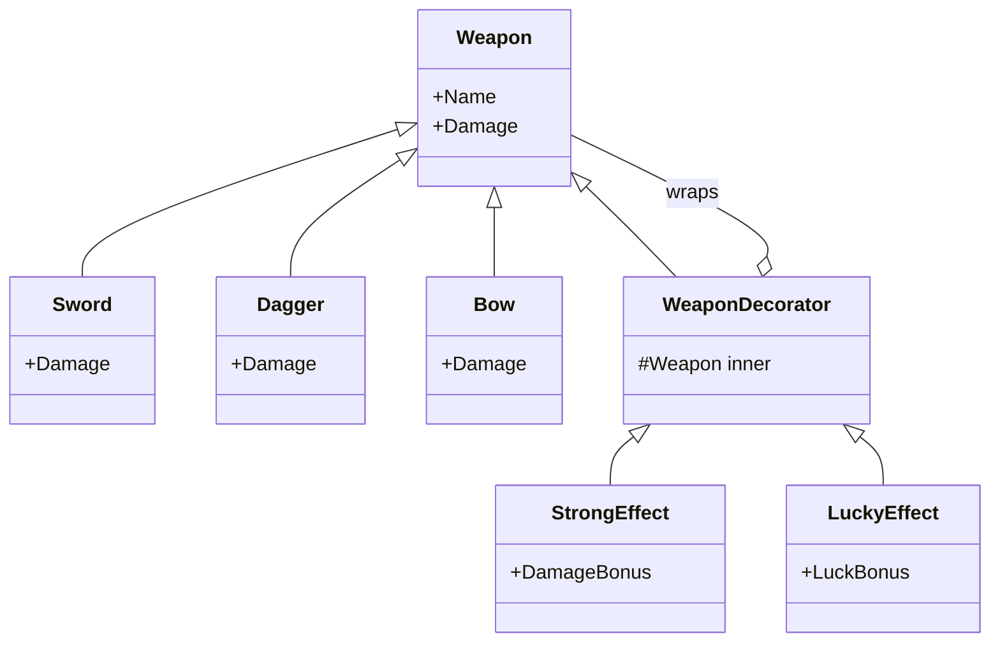
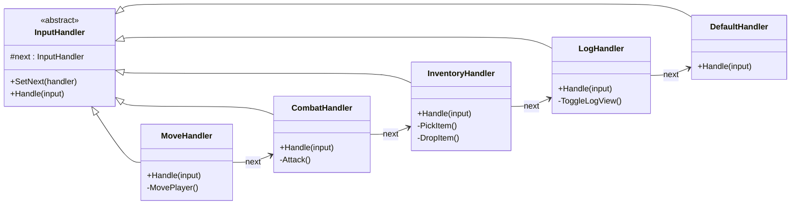
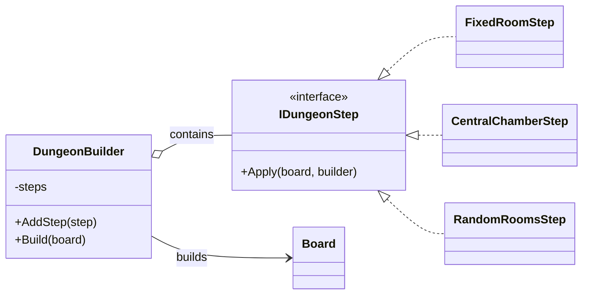
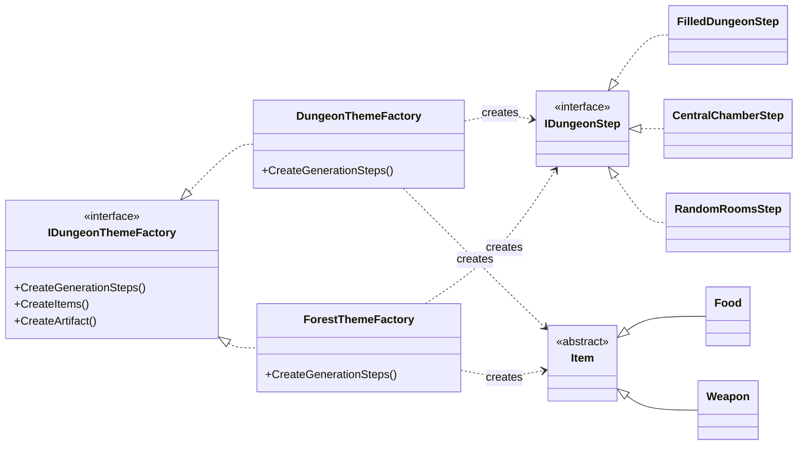
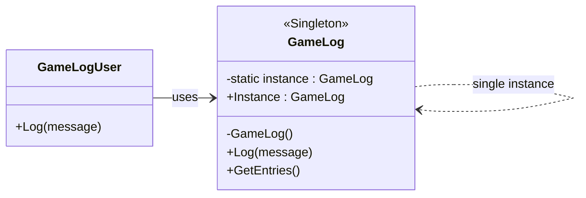
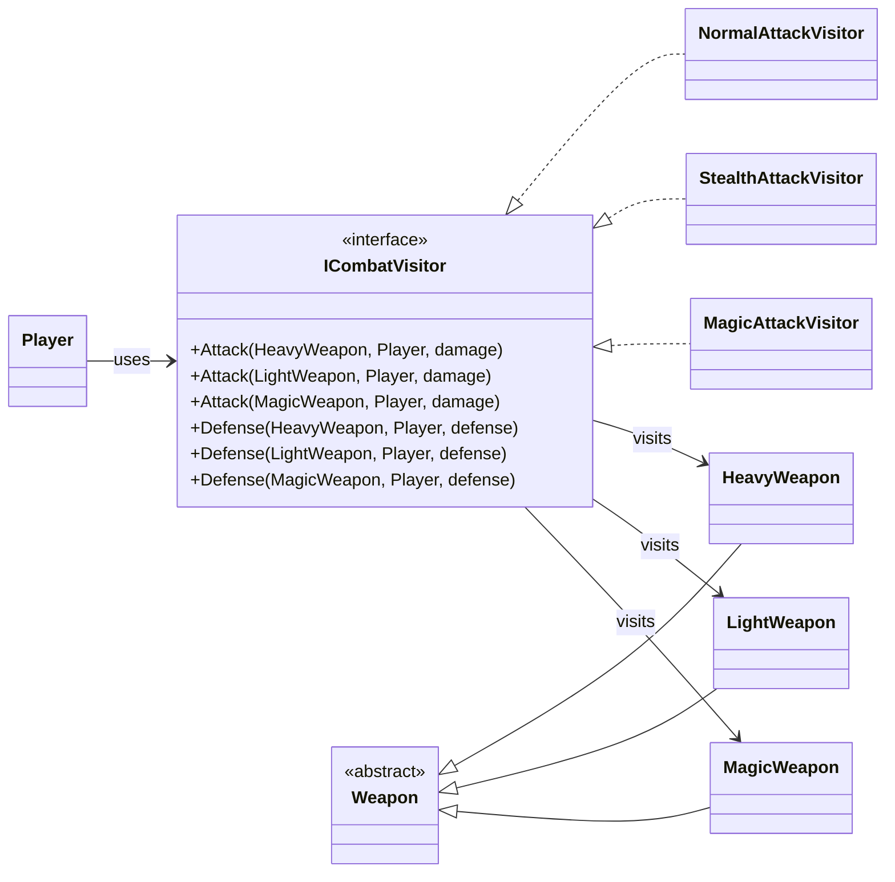
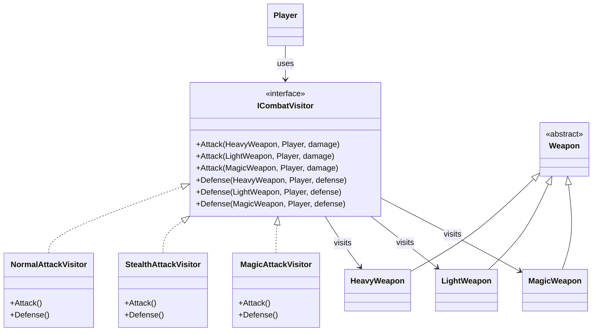
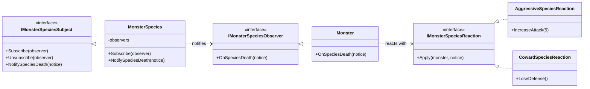

# Wzorce obiektowe

Decorator

### Dekorator
  

Chain of responsibility

#### Chain of responsibility

  

Builder

  
  
#### Builder

  
  

Abstract Factory

#### Abstract Factory

  
  
  

Singleton

  
#### Singleton

w pliku Logging/GameLog.cs

  
  

Visitor I

#### Visitor

w folderze Model/Combat/CombatSystem.cs

  
  
  
  
  
  

Visitor II

  
#### Visitor

  
  
  
  

Observer

#### Observer

/Model/Entities/Species 

  
  
  
  
  

Startegy

  
### Strategy

