# RPGGame multiplayer client-server

A C# multiplayer RPG game where players explore different themed worlds, fight monsters and other players, collect items, and build their characters through weapons and abilities. The game uses TCP networking, JSON-based communication, multithreaded server-side processing, MVC architecture, and advanced object-oriented design patterns to keep the system modular and extensible.


<div align="center">
  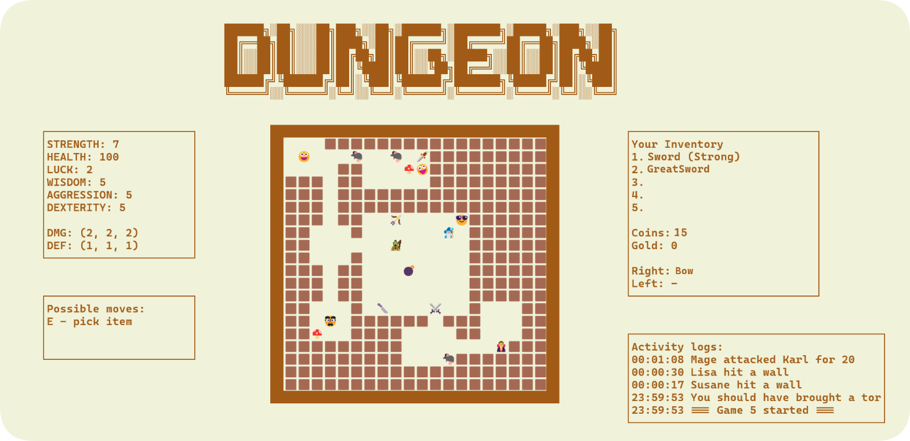
</div>


## Design Patterns

The project uses advanced design patterns to achieve strong modularity and extensibility, applying each pattern to a specific architectural challenge.

<details>
<summary><strong>Builder</strong></summary>

Is responsible for constructing the dungeon map step by step by storing and executing a sequence of generation steps on the `Board`. This separates individual room-generation strategies, such as `FixedRoomStep`, `CentralChamberStep`, and `RandomRoomsStep`, from the building process and allows different combinations of steps to create different dungeon layouts.

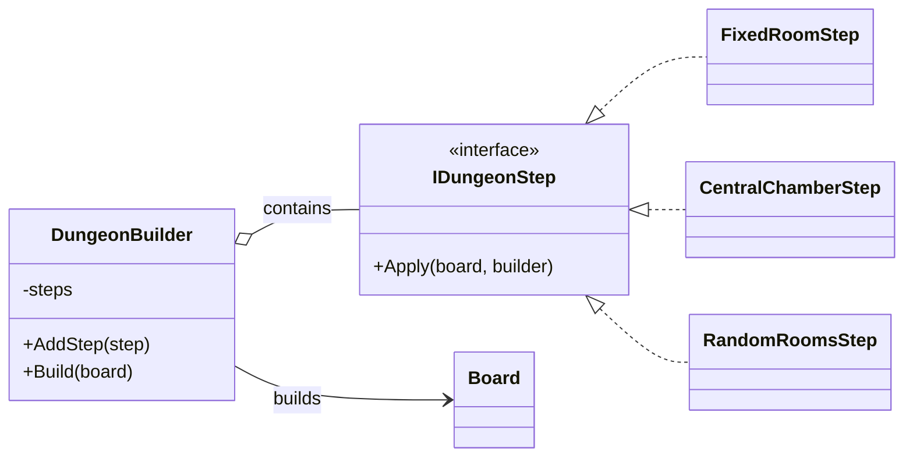

`Model/DungeonBuilding/DungeonBuilder.cs `
`Model/DungeonBuilding/Steps/`

</details>

<details>
<summary><strong>Decorator</strong></summary>

Adds effects to weapons dynamically without modifying their original classes. The weapon itself does not know that it is decorated, allowing effects such as `StrongEffect` and `LuckyEffect` to be combined flexibly while keeping weapons independent.

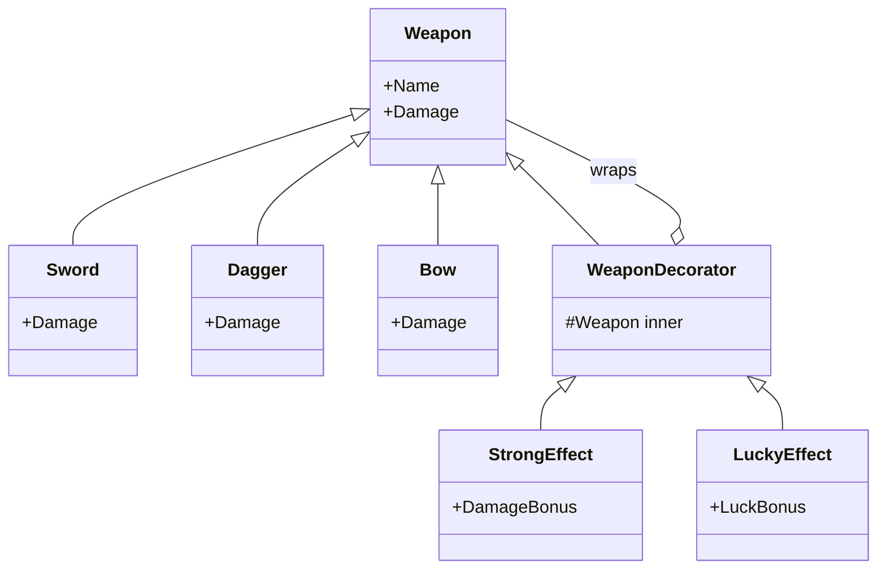

`Model/Items/Weapons/` 
`Model/Items/Weapons/Effects/`

</details>

<details>
<summary><strong>Chain of responsibility</strong></summary>

Handles keyboard input in the game by passing each pressed key through a chain of handlers. Each handler checks whether the key belongs to its responsibility, such as movement, combat, inventory or log view; if not, it passes the input to the next handler. This keeps keyboard handling separated into independent parts of the game.

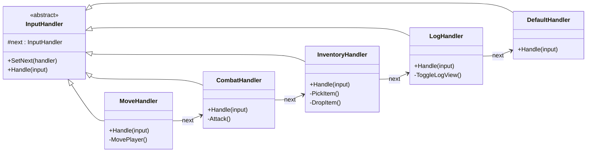

`Model/Input/`

</details>

<details>
<summary><strong>Abstract Factory 🖼️</strong></summary>

Allows the game to create complete dungeon themes such as **Dungeon, Forest and Bank** through the same factory interface. Each theme can provide its own map-generation steps, items and artifacts without duplicating the code responsible for creating and assembling the game world.

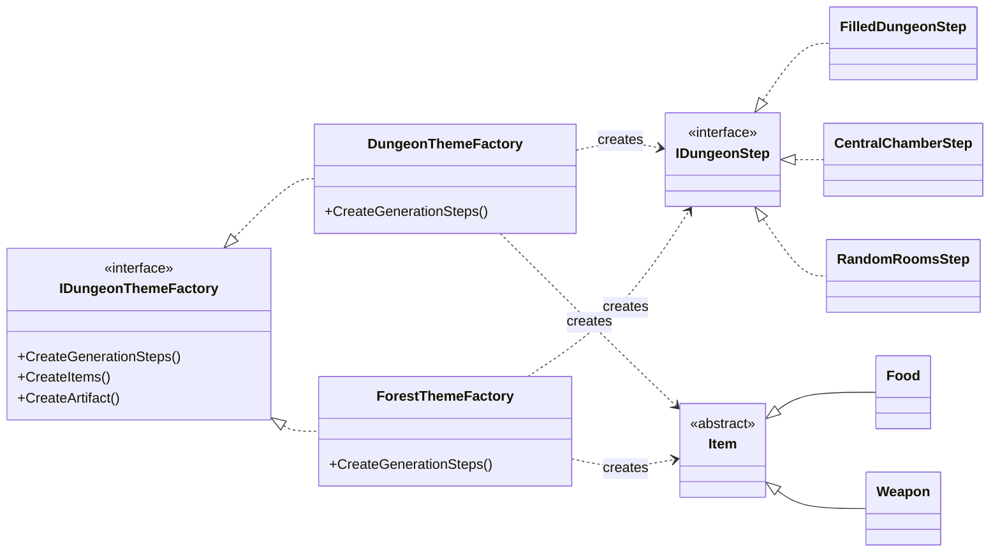

`Model/DungeonBuilding/Themes/`

**Theme comparison**
<div align="center">
  
</div>

</details>

<details>
<summary><strong>Visitor</strong></summary>

Is used in the combat system to calculate attack and defense differently depending on the weapon type and the selected combat style. The key feature is that **new operations can be added without modifying the weapon classes**: `NormalAttackVisitor`, `StealthAttackVisitor` and `MagicAttackVisitor` define how each weapon type behaves, while the weapons themselves remain unchanged.

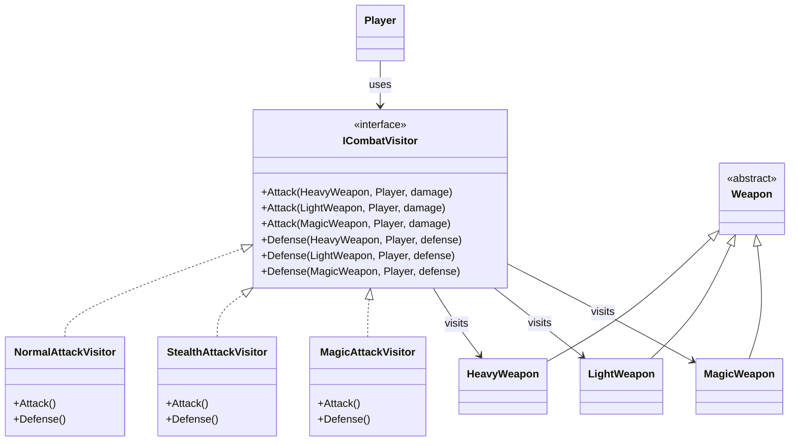

`Model/Combat/`

</details>

<details>
<summary><strong>Observer 🖼️</strong></summary>

Is used in the game to react to the death of a monster belonging to a species. `MonsterSpecies` notifies all subscribed `Monster` objects when one of their members dies, and each monster reacts according to its assigned strategy - for example, `AggressiveSpeciesReaction` increases attack by 5, while `CowardSpeciesReaction` removes its defense. The key feature is that the subject does not need to know how observers react, so new reactions can be added without changing the notification mechanism.


`/Model/Entities/Species` 

<video
  src="https://github.com/user-attachments/assets/44ce433c-aa9b-4249-9ad3-937fa331b6c4"
  autoplay
  muted
  loop
  playsinline
  controls>
</video>

<video
  src="https://github.com/user-attachments/assets/44ce433c-aa9b-4249-9ad3-937fa331b6c4"
  autoplay
  muted
  loop
  playsinline
  controls>
</video>

</details>

<details>
<summary><strong>Singleton 🖼️</strong></summary>

Provides global access to logging from anywhere in the game while ensuring that only one `GameLog` instance exists. This means every part of the project writes to the same centralized log, keeping logging consistent across the entire application.

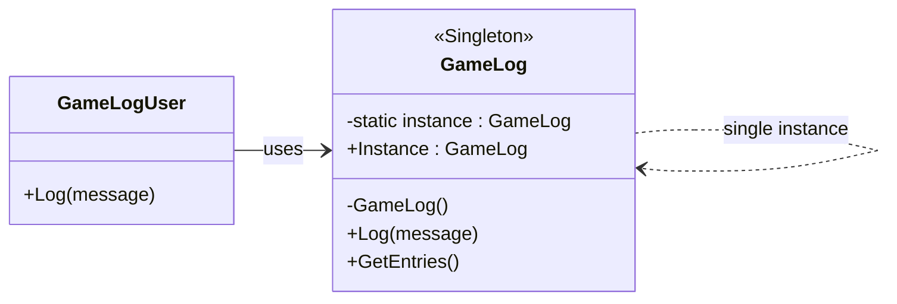

<br>
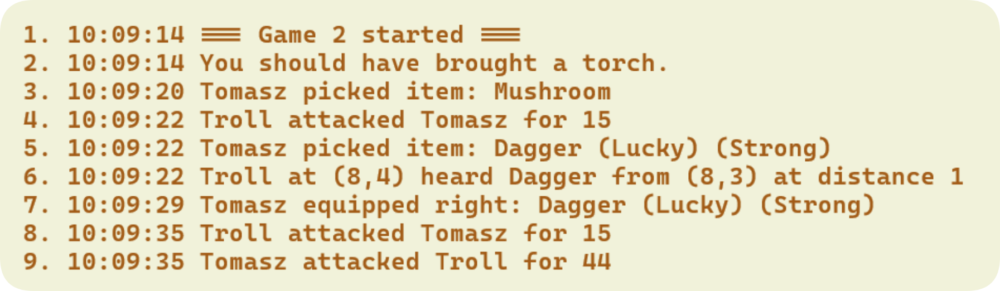
<br>

`Model/Logging/GameLog.cs`

</details>

<details>
<summary><strong>Strategy 🖼️</strong></summary>

Is used in the game to define different movement behaviours for monsters while keeping the `MonsterMovementSystem` independent from their specific logic. Depending on the assigned strategy, a monster can move randomly, follow or flee from sounds, or follow or flee from players. The key feature is that these behaviours are interchangeable, so the movement logic can be changed without modifying `MonsterMovementSystem`.

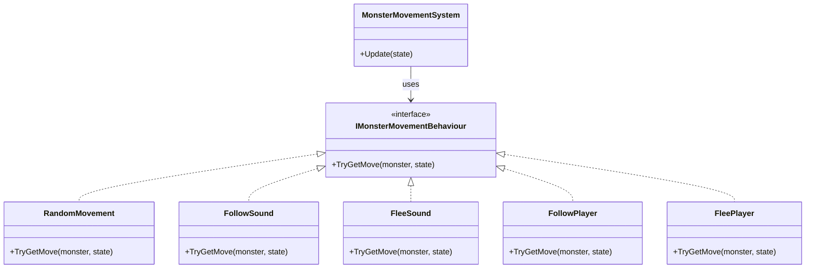

`Model/Entities/Movement/`
`Model/Entities/Movement/Behaviours/`

<!-- <video src="images/followSound.mp4" autoplay muted loop playsinline controls
       style="width: 100%; border-radius: 10px;">
</video> -->

<video
  src="https://github.com/user-attachments/assets/19033e50-bc2c-4abc-a289-93e12be4d98f"
  autoplay
  muted
  loop
  playsinline
  controls>
</video>

<video
  src="https://github.com/user-attachments/assets/19033e50-bc2c-4abc-a289-93e12be4d98f"
  autoplay
  muted
  loop
  playsinline
  controls>
</video>

</details>


---

## MVC - Model View Controller

The project follows the **Model-View-Controller (MVC)** architectural pattern to maintain a clear separation between game logic, user interaction and presentation. Combined with the client-server architecture, this creates a modular structure in which the server remains responsible for the authoritative game state, while the client handles input and presentation.


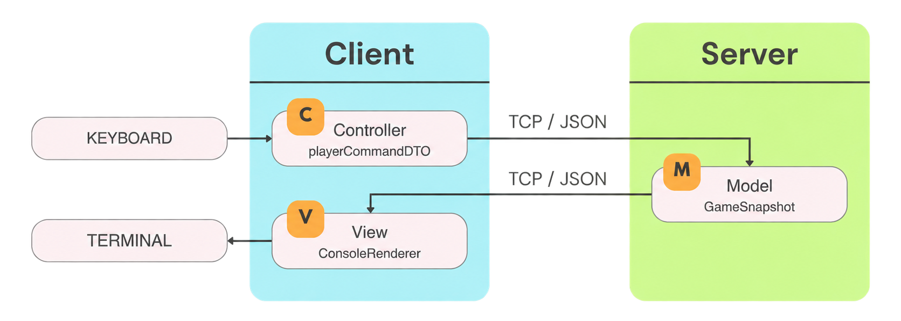


| Component      | Responsibility                                              |
| -------------- | ----------------------------------------------------------- |
| **Model**      | Contains game logic and authoritative state of the world. It manages players, items, combat, dungeon generation and state of the game |
| **Controller** | Processes keyboard input and creates player commands        |
| **View**       | Renders the game state received from the server             |


### Why MVC?

The separation makes the project easier to **maintain, extend and test**. Each part can evolve independently. This also makes it easier to add new gameplay systems, input handlers and visual components without affecting the rest of the code.

---


## Multithreading & Synchronization

The project uses **multithreading to separate network communication, player input and game simulation**, allowing multiple clients to operate simultaneously without blocking each other.

### Server - `N + 3` tasks

* **1× Accept loop** - accepts new client connections.
* **1× Command loop** - processes commands from the shared `ConcurrentQueue`.
* **1× World tick loop** - periodically updates the game world and monster movement.
* **N× Client handlers** - one `HandleClient` task for each connected player, responsible for receiving their messages.  

```text
Accept
   │
   ├── HandleClient #1 ─┐
   ├── HandleClient #2 ─┤
   ├── HandleClient #N ─┤
   │                    ▼
   │              ConcurrentQueue
   │                    │
   ├────────── Command Processing
   │                    │
   └──────────── World Tick
                        │
                     GameModel
```

### Client - 3 tasks

* **Main task** - controls the main client loop.
* **ReceiveSnapshots** - continuously receives game snapshots from the server.
* **SendCommands** - reads keyboard input and sends commands to the server. 

### Synchronization

* **`ConcurrentQueue`** - safely transfers commands from multiple client handlers to the command processor.
* **`modelLock`** - prevents simultaneous modification of the game model. 
* **`clientsLock`** - protects the shared collection of client connections. 

The important design principle is that **network tasks receive data, while game-state changes are performed in controlled server loops**, preventing race conditions and inconsistent game state.

---


## Server – Operation and Responsibilities

The server is responsible for managing the multiplayer session and maintaining the authoritative game state. It handles player connections, names and states, controls the game flow and synchronizes clients.

Its main responsibilities include:

* **Player Management** - Connecting players, assigning names and monitoring their current state.
* **Game Control** - Managing the lobby, introduction, game start, game over and returning players to the lobby.
* **Theme generation** - Selecting and generating different game themes and managing their game elements.
* **Player Monitoring** - Tracking living and dead players and detecting when a round has ended.
* **Ranking** - Recording and displaying player results.
* **Client Synchronization** - Sending regular `GameSnapshot` updates to all connected clients.
* **Server Console** - Providing controls and a live overview of the current session and players.

All game logic is executed on the server, making it the **authoritative source of the game state**.

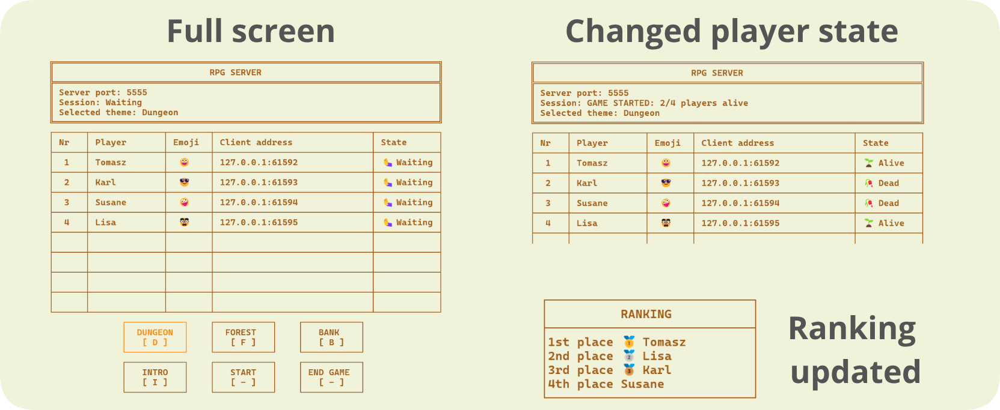


---


## TCP & JSON Communication

The client and server communicate using TCP sockets with JSON-serialized messages. Clients send player commands to the server, while the server processes them and periodically sends updated GameSnapshot data back to the clients. This provides structured and synchronized communication between all players.


---

## Code Structure

```text
RPGGame/
├── Config/
|
├── Controller/
│   ├── GameController.cs
│   └── Input/
|
├── Model/
│   ├── GameModel.cs
│   ├── Combat/
│   ├── DungeonBuilding/
│   ├── Entities/
│   ├── Items/
│   ├── Logging/
│   ├── PlayerInventory/
│   ├── Snapshots/
│   ├── State/
│   ├── Stats/
│   └── World/
│
├── Network/
│   ├── Client/
│   │   └── GameClient.cs
│   ├── Server/
│   │   └── GameServer.cs
│   └── Messages/
│
├── View/
│   ├── ConsoleRenderer.cs
|   └── ...
│
└── Program.cs
```

## Additional Features
The project includes additional gameplay and presentation features that enhance the overall functionality and player experience.


### Extra Weapons
**Bow** - a ranged weapon that allows players to attack enemies from a distance. <br>
**Bomb** - a throwable explosive that detonates after a short countdown.


<video
  src="https://github.com/user-attachments/assets/9929fca3-15e4-42a0-9282-f6c605756554"
  controls>
</video>

### Game Intro
An animated terminal introduction displayed before the game starts.
<video
  src="https://github.com/user-attachments/assets/0b6fc31d-16f5-44ea-be4d-f1527f8dc1ca">
</video>


<br><br>


